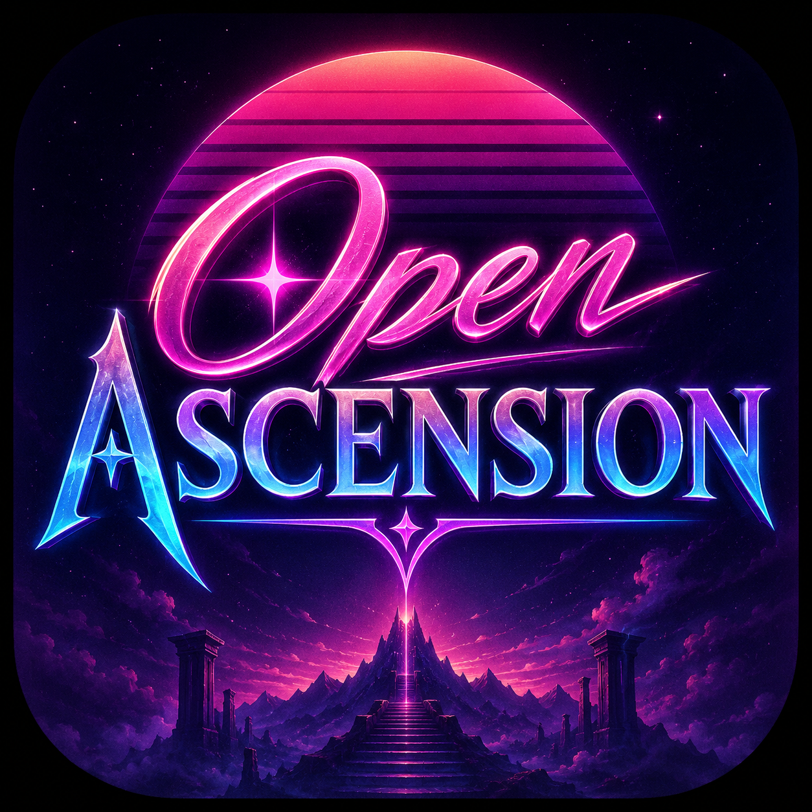

<p align="center">
  
</p>

<h1 align="center">Open Ascension</h1>

<p align="center">
  <strong>The ultimate Project Ascension WoW companion app</strong><br/>
  Classless character builder, mystical enchant browser, gear database & more
</p>

<p align="center">
  <a href="https://github.com/synthalorian/open_ascension/releases/latest">
    
  </a>
  <a href="https://github.com/synthalorian/open_ascension/actions">
    
  </a>
  <a href="https://github.com/synthalorian/open_ascension/blob/master/LICENSE">
    
  </a>
</p>

<p align="center">
  <a href="https://synthalorian.github.io/open_ascension/">🌐 Try the Web App</a>
  &nbsp;•&nbsp;
  <a href="https://github.com/synthalorian/open_ascension/releases/latest">📦 Download Android APK</a>
  &nbsp;•&nbsp;
  <a href="https://ascension.gg/">🎮 Project Ascension</a>
</p>

---

## ✨ What is this?

**Open Ascension** is a companion app for the [Project Ascension](https://ascension.gg/) custom WoW server. It lets you plan and build classless characters with **real game data** scraped from the official Ascension wiki.

Whether you're min-maxing a tank build, theorycrafting a spell-slinging warrior, or just browsing the gear database — this app has you covered.

## 📸 Screenshots

<!-- 
TODO: Add actual screenshots once the web app is live
| Home | Class Builder | Talent Tree | Mystical Enchants | Gear Browser |
|------|---------------|-------------|-------------------|--------------|
| [🖼️]() | [🖼️]() | [🖼️]() | [🖼️]() | [🖼️]() |
-->

## ⚔️ Features

### Class Builder
- Select any of the **9 classic WotLK classes** and **3 specs each**
- Browse abilities filtered by class
- Visual **talent tree with connecting lines and prerequisite enforcement**
- Pick mystical enchants and gear — watch your **stats update in real-time**
- Save builds with shareable base64 codes

### Mystical Enchants (141 real enchants)
All **141 enchantments** scraped directly from the [official Ascension wiki](https://project-ascension.fandom.com/wiki/Enchant_Collection):
- **13 Uncommon (Green)** — minor skill improvements
- **5 Rare (Blue)** — noticeable skill modifications
- **4 Epic (Purple)** — significant gameplay changes
- **119 Legendary (Orange)** — completely transform character mechanics

Includes real enchants like Soulbender, Tools of War, Locust Ranger, Forbidden Technique, Dragon Warrior, and many more.

### Gear Database (200 items)
Comprehensive item database covering:
- **Naxxramas** (T7), **Ulduar** (T8), **Trial of the Crusader** (T9), **Icecrown Citadel** (T10)
- **Emblem of Triumph/Frost** gear
- **PvP Arena** (Season 8 Deadly Gladiator)
- **Profession-crafted** (Blacksmithing, Engineering)
- **Reputation vendors** (Kirin Tor, Wyrmrest, Argent Crusade)
- **Heroic dungeon** drops

Filter by slot, rarity, type, armor type, weapon type, or source.

### Talent Trees
- Full **195 talents** across all 9 classes × 3 specs
- Grid-based visual layout with **connecting prerequisite lines**
- Color-coded locked/unselected/maxed states
- Tap for detailed descriptions

### Build Sharing
- Export builds as **base64 shareable codes** — copy to clipboard and paste anywhere
- Import single builds or batch import multiple at once
- Conflict detection with automatic rename for duplicates

### Stats Computation
- WotLK stat formulas (Str → AP, Agi → Armor, Sta → HP, etc.)
- Per-class default stats at level 80
- Racial bonus integration
- Gear bonuses reflected in computed stats

### Other
- **42 lore entries** across 6 categories (characters, locations, Ascension-specific content)
- **6 realm servers** with status, population, PvP flags, and connection info
- **11 custom themes** (core synthwave + lore-inspired)
- Settings with data export, import, and clear

## 🚀 Quick Start

### Web App (No install)
Visit **[synthalorian.github.io/open_ascension](https://synthalorian.github.io/open_ascension/)** — works in any modern browser.

### Android
Download the latest APK from [Releases](https://github.com/synthalorian/open_ascension/releases/latest) and install.

### Linux Desktop
```bash
git clone https://github.com/synthalorian/open_ascension.git
cd open_ascension
flutter pub get
flutter build linux --release
./build/linux/x64/release/bundle/open_ascension
```

### Build from Source
Requires [Flutter](https://flutter.dev) installed.

```bash
flutter pub get
flutter build linux --release    # Desktop
flutter build web --release      # Web app
flutter build apk --release      # Android APK
```

## 📊 Data Sources

| Category | Count | Source |
|---|---|---|
| Classes | 9 | WotLK core |
| Races | 11 | WotLK core |
| Abilities | 266 | WotLK spell lists |
| Talents | 195 | 9 classes × 3 specs |
| Mystical Enchants | 141 | [Ascension Wiki](https://project-ascension.fandom.com/wiki/Enchant_Collection) |
| Gear Items | 200 | Naxx, Ulduar, TOC, ICC, Emblem, PvP, Professions |
| Lore Entries | 42 | Warcraft lore |
| Realms | 6 | Ascension server list |

## 🛠️ Tech Stack

- **Flutter 3.41.9** — cross-platform UI (Android, web, Linux)
- **Riverpod** — state management
- **go_router** — declarative routing
- **JSON serializable** — model codegen
- **SharedPreferences** — local persistence
- **flutter_animate** — micro-animations

## 📂 Project Structure

```
lib/
├── core/               # Theme, navigation, utilities
│   ├── theme/          # 11 custom themes
│   └── utils/          # Base64 build codes
├── data/               # Models + data
│   ├── models/         # Class, race, ability, talent, enchant, build, gear, etc.
│   └── repositories/   # AppDatabase (SharedPreferences persistence)
└── features/           # Feature screens
    ├── home/           # Quick-access dashboard
    ├── class_builder/  # Abilities, talents, enchants, gear, stats
    ├── talent_tree/    # Visual talent tree with connections
    ├── mystic_enchant/ # Enchant browser by rarity tier
    ├── gear/           # Gear database with multi-filter
    ├── builds/         # Saved build manager + share/import
    ├── lore/           # Lore browser + entry detail
    ├── realms/         # Realm browser
    └── settings/       # Theme selector, data management, about
```

## 🤝 Contributing

PRs welcome! If you have data corrections, new enchants/gear from the wiki, or feature ideas — open an issue or PR.

**Need data help:** The enchant data can always be improved with exact wiki descriptions. If you find discrepancies, let us know.

## 📘 License

MIT License — see [LICENSE](LICENSE) for details.

## 🎵 Credits

- App icon design for "Open Ascension"
- Data scraped from the [Project Ascension Fandom Wiki](https://project-ascension.fandom.com/)
- This project is not officially affiliated with Project Ascension or Blizzard Entertainment

---

<p align="center">
  Made with ❤️ for the Project Ascension community<br/>
  <em>"Classless WoW, companion included"</em>
</p>
